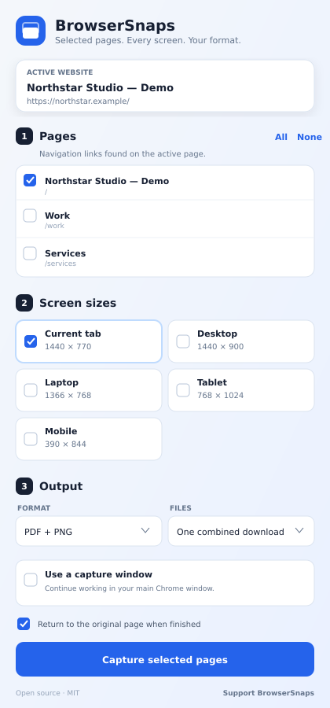
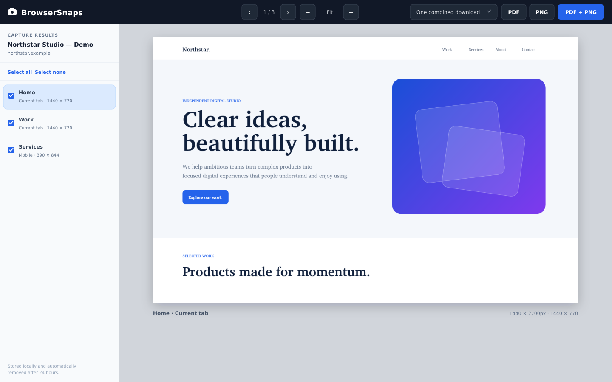
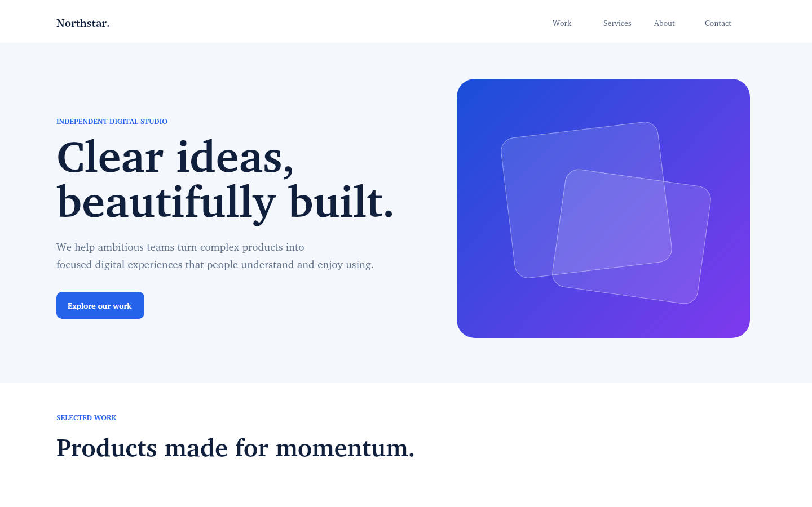

# BrowserSnaps

Capture the current website's navigation pages at one or more screen sizes, review the results, and export them as PDF or PNG — directly from Chrome.

BrowserSnaps is a lightweight, dependency-free Manifest V3 extension. It uses your active tab and existing signed-in browser session, discovers same-site navigation links, scrolls through each selected page, captures every visible viewport, and stitches the tiles into a full-page image. A local results viewer then lets you download PDF, PNG, or both.



## What it does

- Works from the website currently open in the active tab
- Finds links inside `nav`, navigation roles, and page headers
- Lets you tick only the pages you want
- Captures the current browser size by default, plus Desktop, Laptop, Tablet, and Mobile presets
- Scrolls in measured viewport steps with overlap so lazy and scroll-triggered sections appear
- Waits for web fonts, images, and responsive content before capture
- Normalizes browser zoom so every preset uses its exact advertised width
- Reloads every route at every selected screen size
- Neutralizes animation and repeating fixed or sticky elements during capture
- Stitches the viewport tiles into one continuous full-page image
- Paginates long captures onto clean portrait Letter sheets instead of oversized PDF pages
- Opens a local full-page viewer with zoom and capture selection
- Exports PDF, PNG, or a ZIP containing both
- Combines all results or separates them by screen size
- Uses a dedicated capture window so your main Chrome window remains usable
- Restores the original page, browser zoom, and scroll position when finished
- Sends no website data to a server
- Requires no build step and has no production dependencies

## Results viewer

After capturing, BrowserSnaps opens a local results page where you can preview every page and screen size, change the zoom, untick unwanted captures, and choose the final download format.



The viewer uses the stitched full-page image—not separate viewport screenshots—so PDF pages and downloaded PNGs remain visually continuous.

## Install from source

1. Download this repository with **Code → Download ZIP**, then extract it. You can also clone it:

   ```bash
   git clone https://github.com/lewisjohnvillamor/BrowserSnaps.git
   ```

2. Open `chrome://extensions` in Google Chrome.
3. Turn on **Developer mode** in the upper-right corner.
4. Select **Load unpacked**.
5. Choose the extracted `BrowserSnaps` folder — the folder containing `manifest.json`.
6. Pin BrowserSnaps from Chrome's Extensions menu for easy access.

## Use BrowserSnaps

1. Open the website you want to document. Sign in first if the site is private.
2. Select the BrowserSnaps icon in Chrome's toolbar.
3. Tick the navigation pages to capture.
4. Tick one or more screen sizes. **Current tab** is selected by default and uses the browser size you can see.
5. Choose PDF, PNG, or both, then choose one combined download or separate files by screen size.
6. Enable **Use a capture window** if you want to continue working in your main Chrome window. Current-tab mode remains the default for maximum compatibility.
7. Select **Capture selected pages** and approve Chrome's debugging notice if it appears.
8. Keep the dedicated capture window open and unminimized. It may remain behind your main window.
9. Review the stitched captures, untick anything you do not want, then select PDF, PNG, or PDF + PNG.

The blue badge shows progress. A green check means the results are ready. BrowserSnaps restores the working tab to its original window unless you turn restoration off.

> Chrome shows a debugging banner while full-page viewport emulation is active. This is expected: the extension uses the official `chrome.debugger` API and detaches as soon as the capture finishes or is cancelled.

## Screen presets

| Preset | Viewport | Mode |
| --- | ---: | --- |
| Current tab | Your visible browser viewport | Desktop |
| Desktop | 1440 × 900 | Desktop |
| Laptop | 1366 × 768 | Desktop |
| Tablet | 768 × 1024 | Touch/mobile layout |
| Mobile | 390 × 844 | Touch/mobile layout |

Each checked page is captured once per checked screen size. BrowserSnaps scrolls the real page, waits for the layout to settle, captures overlapping viewport tiles, stitches them into one continuous image, scales that image to portrait Letter paper, and continues vertically across clean PDF sheets.

## Export organization

| Selection | PDF | PNG | PDF + PNG |
| --- | --- | --- | --- |
| One combined download | One PDF | One PNG or one ZIP of PNGs | One ZIP containing the combined PDF and PNGs |
| Separate by screen size | One PDF per size | One PNG or ZIP per size | One ZIP per size containing its PDF and PNGs |

Capture results are stored only in Chrome's local extension storage and automatically expire after 24 hours.

### Example captured website

The included demo site is used for documentation and development checks:



## Permissions and privacy

| Permission | Why it is needed |
| --- | --- |
| `activeTab` | Reads and operates only on the tab where you open BrowserSnaps |
| `scripting` | Discovers navigation links and auto-scrolls pages |
| `debugger` | Emulates the optional responsive viewport presets |
| `downloads` | Saves PDF, PNG, and ZIP results |
| `offscreen` | Stitches full-page images without keeping the popup open |

BrowserSnaps has no analytics, remote code, accounts, or backend. Captures and page URLs stay inside your browser. Review [`manifest.json`](manifest.json) and the source in [`src/`](src/) to verify the behavior.

## Limitations

- Chrome internal pages such as `chrome://settings` cannot be captured.
- Only same-origin navigation links are listed. This prevents the capture job from walking into unrelated websites.
- Some sites block automation or change content based on viewport, cookie consent, animations, or login state.
- Video frames, WebGL canvases, and content inside cross-origin iframes may not appear consistently.
- Long pages remain visually continuous and are divided only at portrait Letter print boundaries.
- The capture tab or dedicated capture window must remain open and unminimized until the job completes.
- Without dedicated-window mode, keep the source tab active. With it enabled, work in another Chrome window while the capture window stays open behind it.

## Development

There is no bundler and nothing to compile. Edit the files, then select the **Reload** button for BrowserSnaps on `chrome://extensions`.

```bash
npm run check
npm test
```

The small test suite validates the built-in PDF and ZIP writers. The demo page used in the documentation is at [`docs/demo-site/index.html`](docs/demo-site/index.html).

## Contributing

Issues and pull requests are welcome. Please keep new dependencies optional and preserve the extension's local-first, lightweight design.

## Support

If BrowserSnaps saves you time, you can [support the project through PayPal](https://www.paypal.com/paypalme/lewisjohnvillamor/199).

## License

Copyright © 2026 Lewis John Villamor. Released under the [MIT License](LICENSE).
